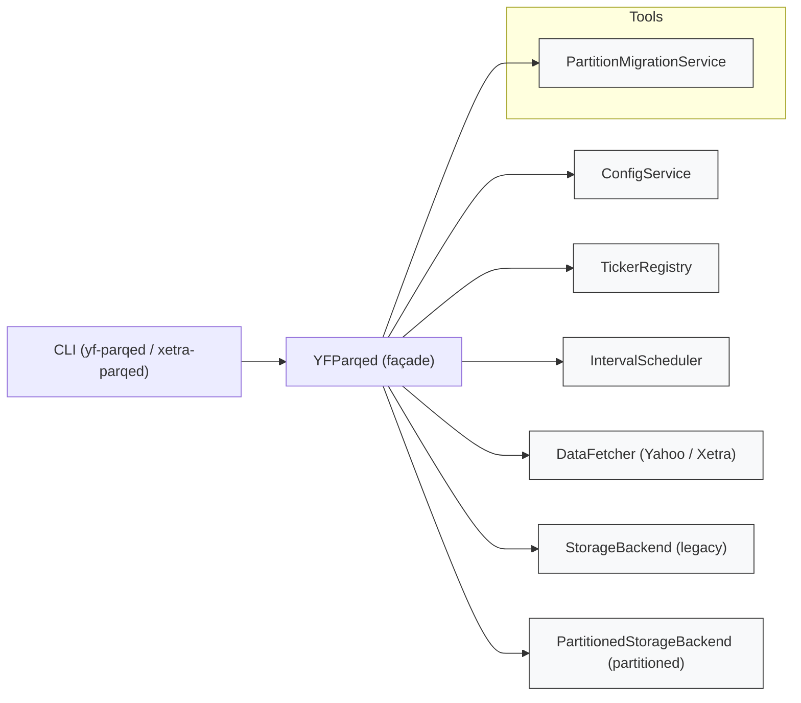
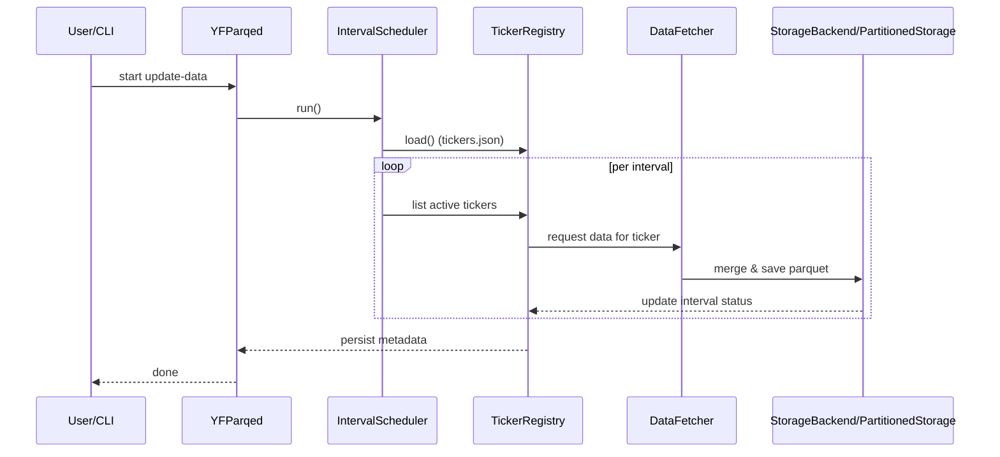
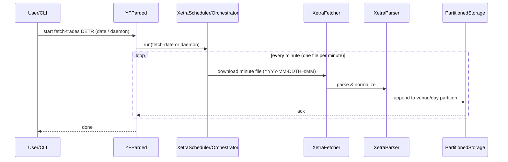

# yf_parqed Architecture (Canonical)
This is the canonical architecture document for the `yf_parqed` project. It captures the post-0.4.x service-oriented design, runtime responsibilities, data flow, deployment notes, and pointers to operational runbooks in the repository.

**Canonical location:** `.github/ARCHITECTURE.md` — use this as the authoritative source for architecture and operational guidance. A short pointer remains at repository root in `ARCHITECTURE.md` for discoverability.

## Overview

`yf_parqed` is a service-oriented Python package that persistently stores interval-aware OHLCV data and raw trade data in Parquet. The runtime is composed of small, testable services wired together by a thin façade (`YFParqed`).

High-level components:

- `ConfigService` — environment, paths, and persistence helpers
- `TickerRegistry` — per-ticker and per-interval lifecycle and metadata (used by the Yahoo/YF pipeline; see note below)
- `IntervalScheduler` — orchestrates periodic update loops by interval
- `DataFetcher` — abstracts data-provider APIs (Yahoo, Xetra) and enforces limits
- `StorageBackend` — legacy flat-parquet storage and corruption recovery
- `PartitionedStorageBackend` — Hive-style partitioned layout for scale
- `PartitionMigrationService` — migration orchestration with verification and rollback

The façade `YFParqed` wires these services and exposes the CLI and programmatic API.

## Diagrams

Below are two lightweight Mermaid diagrams to visualise the repository separation of concerns and the primary data flow through the system.

**Service / Component Structure**





**Primary Data Flow (Xetra ingestion — minute files)**

Xetra raw trade data is produced as one file per minute per venue. The ingestion pipeline downloads these minute files, parses and normalizes them, and appends them into per-venue daily (or monthly) partitions.



## Package Layout

- `src/yf_parqed/common/` — shared utilities, run-lock, path builders
- `src/yf_parqed/yahoo/` — Yahoo-specific fetcher, CLI, and wiring
- `src/yf_parqed/xetra/` — Xetra-specific fetcher, parser, trading hours checks, CLI
- `src/yf_parqed/tools/` — migration and maintenance tools

CLI entrypoints (defined in `pyproject.toml`):

- `yf-parqed` → `yf_parqed.yahoo.yfinance_cli:app`
- `xetra-parqed` → `yf_parqed.xetra.xetra_cli:app`
- `yf-parqed-migrate` → `yf_parqed.tools.partition_migrate:app`

## Data Flow (short)

1. CLI invokes `YFParqed` façade
2. Façade constructs services. Note: the exact services used depend on the command:

	- Yahoo/YF pipeline (`yf-parqed`): constructs `TickerRegistry` and uses `tickers.json` for per-ticker/interval state.
	- Xetra pipeline (`xetra-parqed`): constructs Xetra-specific services (fetcher/parser, trading hours checker) and uses venue/day partitions (raw trades) rather than `tickers.json`.

3. `IntervalScheduler.run()` iterates intervals and invokes per-ticker processors (Yahoo) or per-venue/date processors (Xetra)
4. Processor (Yahoo): read existing parquet → fetch missing data → merge/deduplicate → write partitioned/legacy parquet → update `tickers.json` metadata
	Processor (Xetra): fetch daily trade files → parse/normalize → write per-venue daily/monthly partitions → update any Xetra-specific indices/metadata

## Storage & Migration Principles

Follow the repository's data safety strategy (.github/DATA_SAFETY_STRATEGY.md):

- Non-destructive by default: new layouts must coexist with legacy.
- Verify parity (row counts, checksums, schema) before activation.
- Use staging directories + atomic replace for activation and provide rollback.
- Route reads using metadata in `tickers.json` so legacy and partitioned layouts can coexist indefinitely.

## Runtime & Operational Notes

- Daemon mode: `--daemon` runs a loop respecting trading hours via `TradingHoursChecker`.
- Tracing & diagnostics: add `--mem-debug` or use process-level tracemalloc/objgraph snapshots for memory investigation (see `.github/TROUBLESHOOTING.md`).
- Systemd: Prefer runtime unit drop-ins to set `MemoryHigh`/`MemoryMax` to contain runaway processes.

## Testing & CI

Unit and integration tests exercise services directly. See `.github/TESTING_GUIDE.md` for the canonical testing matrix and the compact coverage map in `.github/AGENTS_SUMMARY.md` for a quick index.

## Where to extend the doc

- Service-level API details belong near the service implementation (module docstrings) and higher-level design decisions belong in ADRs (`docs/adr/`).
- For storage layout changes, update `.github/DATA_SAFETY_STRATEGY.md` and the partition migration tool to keep policy + code in sync.

````
