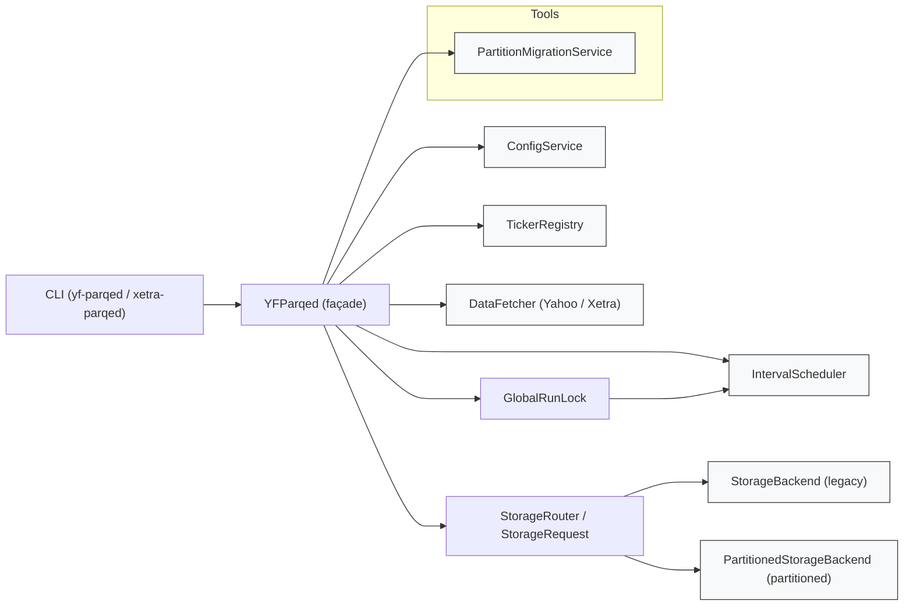
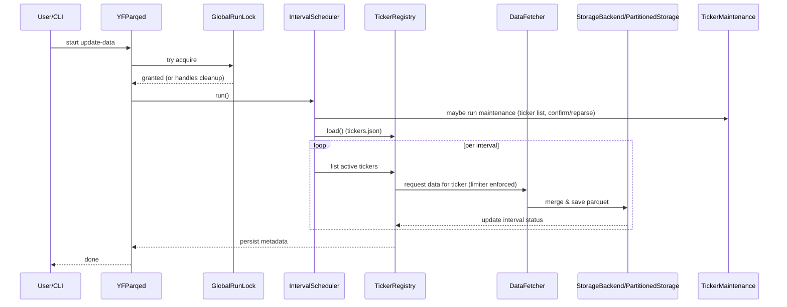
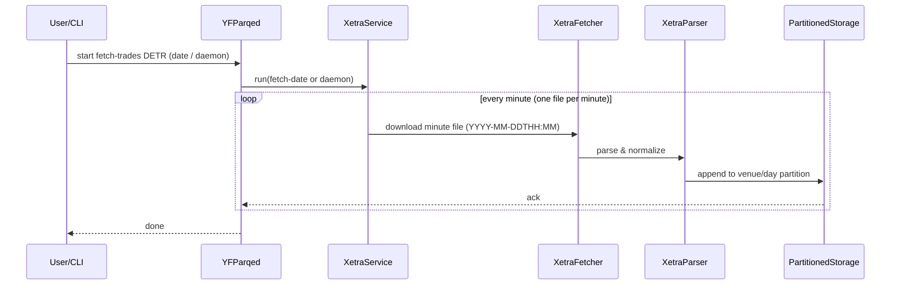

# yf_parqed Architecture (Canonical)
This is the canonical architecture document for the `yf_parqed` project. It captures the post-0.4.x service-oriented design, runtime responsibilities, data flow, deployment notes, and pointers to operational runbooks in the repository.

**Canonical location:** `.github/ARCHITECTURE.md` — use this as the authoritative source for architecture and operational guidance. A short pointer remains at repository root in `ARCHITECTURE.md` for discoverability.

## Overview

`yf_parqed` is a service-oriented Python package that persistently stores interval-aware OHLCV data and raw trade data in Parquet. The runtime is composed of small, testable services wired together by a thin façade (`YFParqed`).

High-level components:

- `ConfigService` — environment, paths, and persistence helpers
- `TickerRegistry` — per-ticker and per-interval lifecycle and metadata (used by the Yahoo/YF pipeline; see note below)
- `IntervalScheduler` — orchestrates periodic update loops by interval
- `DataFetcher` — abstracts data-provider APIs (Yahoo, Xetra) and enforces limits
- `StorageBackend` — legacy flat-parquet storage and corruption recovery
- `PartitionedStorageBackend` — Hive-style partitioned layout for scale
- `PartitionMigrationService` — migration orchestration with verification and rollback

The façade `YFParqed` wires these services and exposes the CLI and programmatic API.

## Diagrams

Below are lightweight Mermaid diagrams to visualise the repository separation of concerns and the primary data flow through the system.

**Service / Component Structure**

A compact diagram showing the runtime separation of concerns: the CLI and façade wire configuration, registry, scheduler, fetchers, storage routing layers, and the global run-lock so each service keeps a single responsibility at runtime.

**Primary Data Flow (Yahoo ingestion — interval-aware)**

The sequence diagram below shows the per-interval, per-ticker update loop used by the Yahoo (yfinance) pipeline: a run-lock is acquired, maintenance runs (ticker list refresh, confirm/reparse not-founds), and the scheduler iterates configured intervals while the fetcher observes rate limits and writes through the storage router. `TickerRegistry` keeps interval-specific metadata and cooldowns for every ticker.

**Primary Data Flow (Xetra ingestion — minute files)**

Xetra raw trade data is produced as one file per minute per venue. The ingestion pipeline downloads these minute files, parses and normalizes them, and appends them into per-venue daily (or monthly) partitions. The `XetraService` orchestrator derives rate limits from `ConfigService` and drives the fetcher/parser/partitioned storage loop.

## Package Layout
